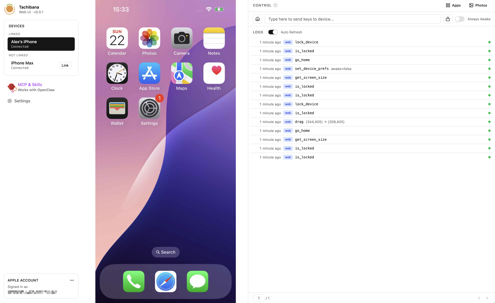
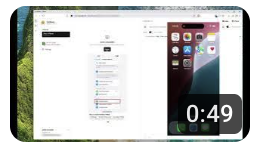
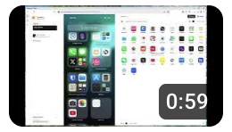
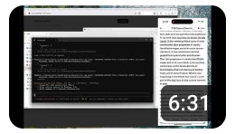
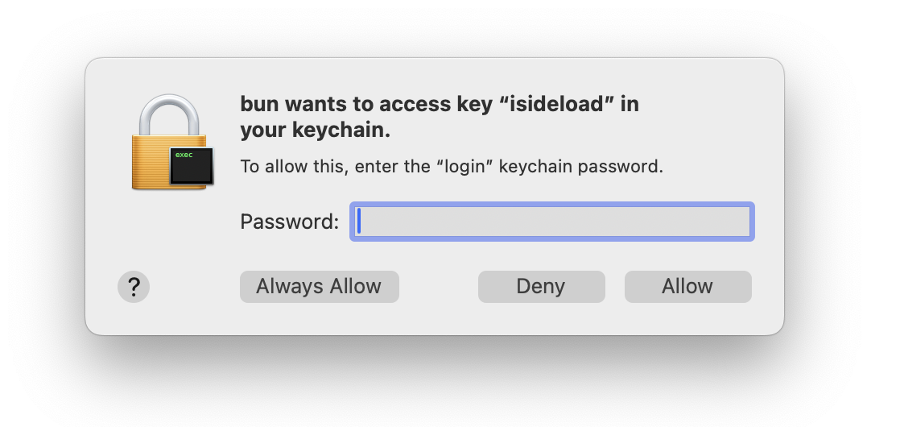
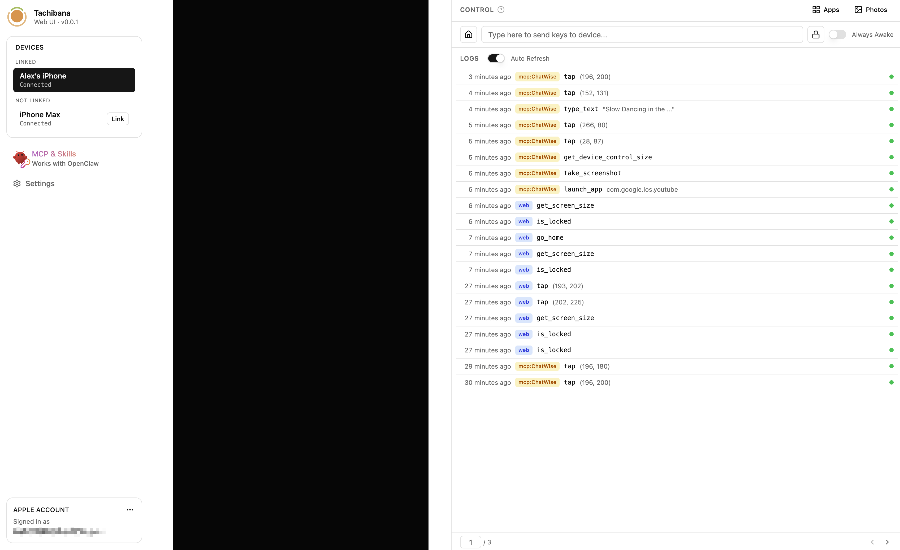

# Tachibana

An iOS / iPadOS control utility, as a Web UI, an MCP server, and an AgentSkill for your favorite agents.

<p align="center">
  
</p>

## Demo Videos

| Topic                | Video                                                                                                                                        |
| -------------------- | -------------------------------------------------------------------------------------------------------------------------------------------- |
| Installation & Setup | <a href="https://www.youtube.com/watch?v=LqXPuYBD4O8"></a>      |
| Using the Web UI     | <a href="https://www.youtube.com/watch?v=qS0Hbfgzrnk"></a>     |
| Using as MCP Server  | <a href="https://www.youtube.com/watch?v=Fryg0pR3qvM"></a>   |
| Using as AgentSkill  | <a href="https://www.youtube.com/watch?v=mgbKN5qaIq4"></a> |

## Installation

Head to the [latest release](https://github.com/Paranoid-AF/tachibana/releases/latest) page for downloads.

**NOTE:** If you decide not to use installer or package manager, you need **"sudo"** or **"Run as Administrator"** to run the main binary `./tachibana` or `.\tachibana.exe`. This is to ensure the tunnel gets established properly.

### Windows

| Architecture | Installer                                                                                                                | ZIP file                                                                                                                 |
| ------------ | ------------------------------------------------------------------------------------------------------------------------ | ------------------------------------------------------------------------------------------------------------------------ |
| x64          | [tachibana-windows-x64.msi](https://github.com/Paranoid-AF/tachibana/releases/latest/download/tachibana-windows-x64.msi) | [tachibana-windows-x64.zip](https://github.com/Paranoid-AF/tachibana/releases/latest/download/tachibana-windows-x64.zip) |

The MSI installer registers Tachibana as a Windows service automatically.

### macOS (Homebrew)

```bash
brew tap Paranoid-AF/tap
brew install tachibana

# For macOS users, it is required to start it manually.
# This is due to macOS is designed to have no keychain access for root user, so starting it as a sudo service will not work.
sudo tachibana
```

To uninstall, you may need to remove the keg manually since `sudo tachibana` creates root-owned files:

```bash
brew uninstall tachibana
sudo rm -rf /opt/homebrew/Cellar/tachibana/
```

### macOS (manual)

| Architecture        | Download                                                                                                                         |
| ------------------- | -------------------------------------------------------------------------------------------------------------------------------- |
| Apple Silicon (M1+) | [tachibana-darwin-arm64.tar.gz](https://github.com/Paranoid-AF/tachibana/releases/latest/download/tachibana-darwin-arm64.tar.gz) |
| Intel               | [tachibana-darwin-x64.tar.gz](https://github.com/Paranoid-AF/tachibana/releases/latest/download/tachibana-darwin-x64.tar.gz)     |

### Linux (not tested)

<details>
<summary>Linux builds are provided but have not been tested yet. Click to expand.</summary>

| Architecture    | .tar.gz                                                                                                                        | .deb                                                                     | .rpm                                                                       |
| --------------- | ------------------------------------------------------------------------------------------------------------------------------ | ------------------------------------------------------------------------ | -------------------------------------------------------------------------- |
| x64 (amd64)     | [tachibana-linux-x64.tar.gz](https://github.com/Paranoid-AF/tachibana/releases/latest/download/tachibana-linux-x64.tar.gz)     | [.deb (amd64)](https://github.com/Paranoid-AF/tachibana/releases/latest) | [.rpm (x86_64)](https://github.com/Paranoid-AF/tachibana/releases/latest)  |
| ARM64 (aarch64) | [tachibana-linux-arm64.tar.gz](https://github.com/Paranoid-AF/tachibana/releases/latest/download/tachibana-linux-arm64.tar.gz) | [.deb (arm64)](https://github.com/Paranoid-AF/tachibana/releases/latest) | [.rpm (aarch64)](https://github.com/Paranoid-AF/tachibana/releases/latest) |

After installing a `.deb` or `.rpm`, start the service:

```bash
sudo systemctl start tachibana
```

</details>

## Setup and use Web UI

**[Visit Web UI in your browser, by clicking here.](http://localhost:17962/)**

## Troubleshooting

### Caveats on Windows

#### Unable to connect any device

For Windows, you might need to install [Apple Devices from Microsoft Store](https://apps.microsoft.com/detail/9np83lwlpz9k?hl=en-US&gl=US) first. This ensures you have the proper drivers installed for iPhone / iPad.

### Caveats on macOS

#### macOS stops the app from running

If you download the tarball, you might be blocked from running the app. This is because there is no code signature on the binary, which requires the Apple Developer Program (not considered for now).

You can run the following command to lift the restriction:

```shell
xattr -d com.apple.quarantine ./tachibana && \
  xattr -d com.apple.quarantine **/*.node && \
  xattr -d com.apple.quarantine **/*.dylib && \
  xattr -d com.apple.quarantine ./bin/ios
```

#### App requesting keychain access

It is normal to be prompted for keychain access 3 times on macOS, for:

- **Tachibana** itself, to store and retrieve Apple Account credentials and Web UI login state securely.
- **isideload**, a dependency to manage iDevices.
- **go-ios**, a dependency to establish USB tunnels.

In each case, enter your **macOS user password** and click **"Always Allow"**.

<p align="center">
  
</p>

### Black screen in Web UI

This most likely means your device is locked. You can unlock it right in the Web UI by clicking the **"Home" button** under the CONTROL section to unlock and enter the home screen.

<p align="center">
  
</p>

## How does this work?

Tachibana communicates with iOS / iPadOS devices over USB (or network tunnels) and exposes control capabilities through multiple interfaces.

```
+----------------+     +----------------+     +-------------------+
|   Web UI       |     |   MCP Client   |     |  Agent (Skill)    |
|   (React)      |     |   (CLI)        |     |                   |
+-------+--------+     +-------+--------+     +--------+----------+
        |                       |                       |
        +-----------------------+-----------------------+
                                |
                       +--------v--------+
                       |   Elysia.js     |
                       |   API Server    |
                       +--------+--------+
                                |
                +---------------+---------------+
                |                               |
     +----------v----------+         +---------v---------+
     |   ios-connect        |         |   ios-wda          |
     |   (Rust NAPI addon)  |         |   (WebDriverAgent) |
     +----------+-----------+         +---------+----------+
                |                               |
                +---------------+---------------+
                                |
                    +-----------v-----------+
                    |   iPhone / iPad       |
                    |   (via USB / Tunnel)  |
                    +-----------------------+
```

- **Web UI** - A React frontend served by the API server, providing a graphical interface for device screen viewing and control.
- **API Server** - An Elysia.js backend that manages device connections, proxies commands, and serves the Web UI.
- **ios-connect** - A Rust-based NAPI addon that bridges Node.js to native iOS device APIs (via `idevice` and `isideload`).
- **ios-wda** - Bundles and manages [WebDriverAgent](https://github.com/appium/WebDriverAgent), which runs on the device to accept UI automation commands.
- **MCP Server / AgentSkill** - Exposes device control as tool calls for AI agents via the Model Context Protocol.
- **go-ios** - Handles USB tunneling, especially for iOS 17+ devices that require a TUN-based connection.

## Known issues

In Web UI, sometimes the screen fails to appear. This often happens on first setup, or when a device is unplugged and plugged back in.

You can either:

- Wait for a moment, and click the "Retry" button multiple times.
- Avoid unplugging the device while using it.

## Configuration

Tachibana reads its configuration from a JSON file located at:

- **macOS / Linux:** `~/.local/state/tachibana/config.json`
- **Windows:** `%APPDATA%\tachibana\config.json`

Only non-default values need to be specified. Example:

```json
{
  "server": {
    "port": 8080
  }
}
```

| Property       | Description                           | Default                                 |
| -------------- | ------------------------------------- | --------------------------------------- |
| `server.port`  | Port the server listens on            | `17962`                                 |
| `server.host`  | Host / IP address the server binds to | `localhost`                             |
| `wda.bundleId` | Custom bundle ID for WebDriverAgent   | `""`, randomly generated on first start |

## Third-Party Software

Special shout-out to these wonderful projects - Tachibana cannot function without them:

- [WebDriverAgent](https://github.com/appium/WebDriverAgent)
- [isideload](https://github.com/nab138/isideload)
- [idevice](https://github.com/jkcoxson/idevice)
- [go-ios](https://github.com/danielpaulus/go-ios)
- [napi-rs](https://napi.rs/)
- [ElysiaJS](https://elysiajs.com/)
- [Bun](https://bun.com/)
- [Wintun](https://www.wintun.net/)

Also, this project requires [DeveloperDiskImage](https://github.com/doronz88/DeveloperDiskImage/tree/main/PersonalizedImages/Xcode_iOS_DDI_Personalized) collected by `doronz88`, who created the classic `pymobiledevice3`. They are the best!

Since dependencies are too many to list here, you can check out files like `package.json` and `Cargo.toml` to see them all.
